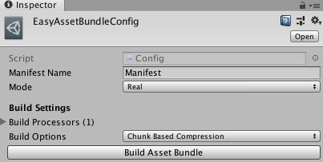
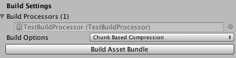

# EasyAssetBundle

AssetBundle的简易封装，同时提供异步(async await)和同步api，
所有api命名和功能及用法都基本与Unity AssetBundle类中的api相同。
不同的是内部会自动管理AssetBundle的依赖关系，做引用计数，适时的加载和卸载依赖包。

> 整体的设置和打包操作通过EasyAssetBundleConfig Inspector UI 实现。



**两种模式**
1.  Virtual 模拟模式
>  内部加载资源直接通过AssetDatabase读取，本质上所有加载动作都是同步进行的，
加载速度快。主要用于前期开发，方便迭代。
2.  Real 实模式
>  需要提前打好AssetBundle，内部通过真实的AssetBundle读取资源，接近真机状态下的表现。
主要用在后期需要在编辑器下验证资源加载速度等场景中。

**三种加载方式**
1.  代码中通过字符串加载
```cs
IAssetBundle ab = await AssetBundleLoader.instance.LoadAsync("AssetBundle Name");
var asset = await ab.LoadAssetAsync<AssetType>("Asset Name");
// 省略若干操作
ab.Unload(); // 在合适的时候卸载资源
```
2. 通过AssetBundleReference加载
```cs
// 首先在MonoBehavior或者ScriptableObject脚本中声明引用字段，并且在编辑器中将设置好AssetBundle名称的资源拖入
[SerializeField] AssetBundleReference _abRef;

// AssetBundle名实际上已经通过编辑器设置好了，Load api中就不再需要传入名称。
IAssetBundle ab = await _abRef.LoadAsync();
var asset = await ab.LoadAssetAsync<AssetType>("Asset Name");
// 省略若干操作
ab.Unload(); // 在合适的时候卸载资源
```
3. 通过AssetReference加载
```cs
// 同上AssetBundleReference用法，这里不同的是编辑器中拖入资源后，引用的是AssetBundle Name和其中的某个资源名
[SerializeField] AssetReference _assetRef;

// 这里加载资源不需要传入AssetBundle Name和Asset Name了
var asset = await _assetRef.LoadAsync();
// 省略若干操作

// 这里资源卸载略有不同
_assetRef.Unload();
```
>  同步模式的api名称只是相对于异步模式去掉Async字样。

>  需要注意的是两种Reference方式主要是为了避免在代码中硬编码字符串，但是目前并
没有提供随着编辑器中AssetBundle名称更改同步更改其中序列化名称的机制，因此在实际使用
中尽量减少重命名资源名和AssetBundle名称。
* [ ]  添加AssetBundle Name重命名机制

**构建处理器**

通过创建继承自`AbstractBuildProcessor`的子类，并且创建对应的ScriptableObject，可以在构建AssetBundle之前和之后执行任意操作(如加密解密文本文件)。
```cs
[CreateAssetMenu(fileName = "TestBuildProcessor", menuName = "BuildProcessors/TestBuildProcessor")]
public class TestBuildProcessor : AbstractBuildProcessor
{
    public override void BeforeBuild()
    {
        Debug.Log("Before build!");
    }

    public override void AfterBuild()
    {
        Debug.Log("After build!");
    }
}
```
创建ScriptableObject之后EasyAssetBundleConfig Inspector UI中会显示出对应条目。



可以创建任意多个构建处理器，构建时会按照一定的顺序执行。